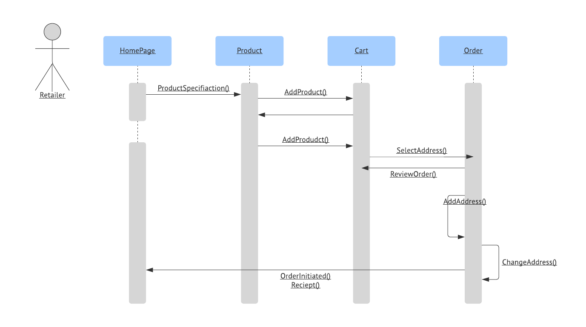

# GreatOutDoor-AddToCart-Service

A new spring add to cart rest service for Great OutDoors project.

### Overview
In an e-commerce site, a retailer or a customer chooses different products to place the order. For that, he needs to add the products to his cart. So, cart plays a very important role for placing the order in the e-commerce sites. We have tried to make the process of adding the item to cart an easier one so that the customer doesn’t find any difficulties or complexities in adding the item to the cart. The product will be added to the cart only when the credential of the retailer is correct.

### Prerequisite 
User must be logged in as retailer to perform the add item to cart functionality. He/she has to give his/her correct credential to add the item into the cart. 
Eureka discovery server should be running on your machine.

### Implemented By: 
#### Sachiket Behera

### Use Case Diagram 

### Sequence Diagram 

### ER Diagram 

### Application info :
You can change this properties in resource/application.properties
* Port - 8150
* Application name - add-to-cart-service
* Database - for devlopment [H2](https://www.h2database.com/) and for production [Oracle](https://www.oracle.com/). 

## Getting Started

For help getting started with Spring, view online
[documentation](https://spring.io/).

